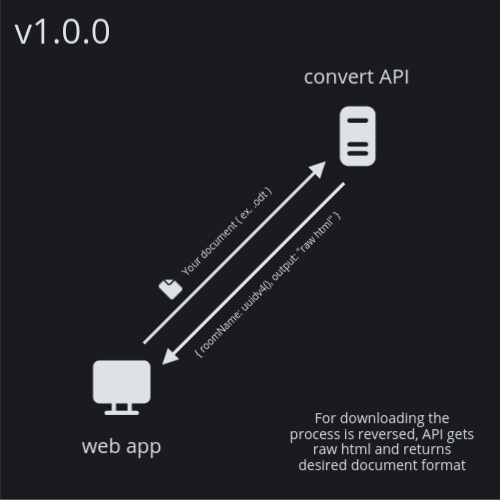

<p align="center">
    <strong>Free & Open source document collaboration tool</strong>
</p>

<p align="center">
    
    
    
</p>

<br />

<h3 align="center">
    <a href="https://github.com/cufta22/odf-collab/blob/master/CONTRIBUTING.md">Contribute</a>
    <span> · </span>
    <a href="">Community</a>
    <span> · </span>
    <a href="">Documentation</a>
</h3>

## Structure

| Codebase     |   Description   |                                  Domain                                  |
| :----------- | :-------------: | :----------------------------------------------------------------------: |
| [api](api)   |   Node.js API   |              [api.odfcollab.com](https://api.odfcollab/com)              |
| [web](web)   | Next.js web app | [prod](https://odfcollab/com) / [staging](https://staging.odfcollab/com) |
| [core](core) |   Shared code   |                                    /                                     |

<!-- | [design](design)   |  All project assets  |   /   | -->
<!-- | [mobile](mobile)   |  Mobile app          |   /   | -->
<!-- | [desktop](desktop) |  Desktop app         |   /   | -->

## Getting Started

Install the dependencies and run the development server:

```bash
# Website
npm i
npm run dev

# API
# NOTE: For running the API convert functions locally
# you'll need LibreOffice installed, I suggest you use hosted api
npm i
npm run dev

```

Next.js app runs locally on [http://localhost:3000](http://localhost:3000)

Node API runs locally on [http://localhost:4000](http://localhost:4000)

## Branches

- staging -> pr this branch for everything
- master -> don't touch, this is what's running in prod

If you're working on a **new feature**, create a feature branch - [ feature/\* ] ( ex. feature/auth )

If you're working on an **issue**, create an issue branch - [ fix/issue-\* ] ( ex. fix/issue-1234 )

## Contributing

See [CONTRIBUTING.md](https://github.com/CUFTA22/odf-collab/blob/master/CONTRIBUTING.md) for all details.

Also check out the [Project Board](https://tree.taiga.io/project/cufta22-odf-collab/kanban) for all available and future tasks

I recommend creating an issue or message me on discord [ cufta22#8160 ] to let me know what you are working on first that way we don't overwrite each other.

## Code of Conduct

Please read [CODE_OF_CONDUCT.md](https://github.com/CUFTA22/odf-collab/blob/master/CODE_OF_CONDUCT.md) for details on our code of conduct.

## How it Works

Convert API is only used to convert documents to desired formats and doesn't store anything on the server, it works by using the libreoffice --convert-to API through a Node.js wrapper library.

<p align="center">

</p>
