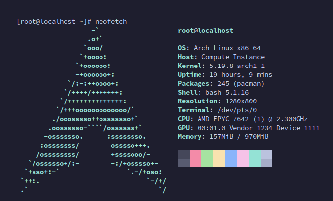

## Getting Started

Install the dependencies and run the development server:

```bash
# NOTE: For running the API convert functions locally
# you'll need LibreOffice installed, I suggest you use hosted api

# Install the dependencies
npm i

# Run in development
npm run dev
```

Node API runs locally on [http://localhost:4000](http://localhost:4000)

<br />

## Servers

| Location      | Branch |                     Domain                     |
| :------------ | :----: | :--------------------------------------------: |
| EU, Frankfurt | master | [api.odfcollab.com](https://api.odfcollab.com) |

<br />

## How it Works

Convert API is only used to convert documents to desired formats and doesn't store anything on the server, it works by using the libreoffice --convert-to API through a Node.js wrapper library.

Endpoints:

- **/** -> Hello World!
- **/convert** -> Converts documents ( html, odf, pdf )
- **/new-doc** -> Just returns the uuid for roomName
- **/prepare-download** -> Converts a file and saves in /temp
- **/download** -> Downloads a file and removes it from /temp

<br />
<hr />
<br />

## EU Server uses Arch, btw.


